# Co-DPReS: Edge AI Lego Brick Classifier & Sorter
### Real-Time TinyML Inference on Arduino Portenta H7 with TensorFlow Lite Micro

[](https://store.arduino.cc/products/portenta-h7)
[](#hardware-architecture)
[](https://www.tensorflow.org/lite/microcontrollers)
[](#machine-learning-pipeline)
[](LICENSE)

---

## Executive Summary

The Convolution Driven Piece Recognition System (Co-DPReS) implements an end-to-end **TinyML (Edge AI) embedded vision pipeline** capable of autonomous Lego piece detection and multi-class shape classification directly on an ultra-low-power microcontroller.

The entire lifecycle—ranging from raw grayscale frame acquisition via CMOS sensor, morphological image pre-processing, region-of-interest (ROI) extraction, to neural network inference—is executed locally on an **Arduino Portenta H7 (STM32H747XI dual-core ARM Cortex-M7/M4)** equipped with a **Portenta Vision Shield**.

---

## Key Highlights & Technical Accomplishments

- **Zero-Cloud Low-Latency Processing:** Real-time inference without offloading data to cloud or external gateways.
- **Embedded Computer Vision Pipeline:** Grayscale capture (320x240 @ 30 FPS) with custom Ping-Pong buffering, background subtraction, and 3x3 morphological erosion/dilation for bounding box extraction.
- **Microcontroller Memory Management:** Dynamic model allocation leveraging external **SDRAM** with ARM MPU (Memory Protection Unit) cache configuration to accommodate a 2 MB tensor arena.
- **Edge Model Optimization:** Deep Convolutional Neural Network (CNN) trained and optimized via **Structured Pruning** and **Post-Training INT8 Quantization**, drastically minimizing memory footprint while maintaining >90% validation accuracy.

---

## System Architecture

```mermaid
flowchart LR
    A[Himax HM01B0 Sensor] -->|320x240 Grayscale| B[Ping-Pong Frame Buffer]
    B --> C[Background Subtraction]
    C --> D[Morphological Filtering]
    D --> E[Bounding Box & Cropping]
    E -->|Normalized 128x128| F[TFLite Micro Interpreter]
    F -->|INT8 Quantized Model| G[SDRAM Tensor Arena]
    G --> H[Class Prediction]
```



### Hardware Specifications
- **MCU:** Arduino Portenta H7 (Cortex-M7 @ 480 MHz / Cortex-M4 @ 240 MHz).
- **Vision Shield:** Himax HM01B0 ultra-low-power CMOS grayscale camera.
- **Memory Setup:** External SDRAM initialized for tensor arena execution.

---

## Machine Learning Pipeline

1. **Dataset & Augmentation:** Synthetic dataset of 12,000 renders with Sim-to-Real adaptation (Gaussian Noise, Block Noise) to simulate sensor thermal noise and physical artifacts.
2. **Model Architecture:** Custom lightweight CNN topology optimized for microcontroller execution (Strided Convolutions, Group Normalization, Global Average Pooling).
3. **Compression & Deployment:**
   - **Quantization:** Fully integer-quantized (INT8) input/output graph to exploit hardware SIMD instructions.
   - **Export:** Converted directly to byte-array C header (`lego_model.h`) compatible with standard C++ embedded toolchains (model size: ~376 KB).

---

## Repository Structure

```text
├── docs/
│   ├── report.pdf                  # Full technical engineering report (Co-DPReS)
├── firmware/                       # Embedded C++ / Arduino sketches
│   ├── lego_model.ino              # Core camera grab loop & TFLite inference
│   └── lego_model.h                # Exported INT8 model weights
├── ml/                             # Model training & optimization scripts
│   ├── lego_model_pytorch.ipynb    # Training notebook
│   └── my_transforms.py            # Augmentation pipeline
└── tools/
    └── camera-viewer.py            # Diagnostic live-stream Python tool via serial
```

---

## Authors

- **Etienne Orio**
- **Manuel Tagliaferri**
- **Giovanni Elisei**

*Project developed for the Edge Computing in the IoT course at Università della Svizzera italiana (USI).*
